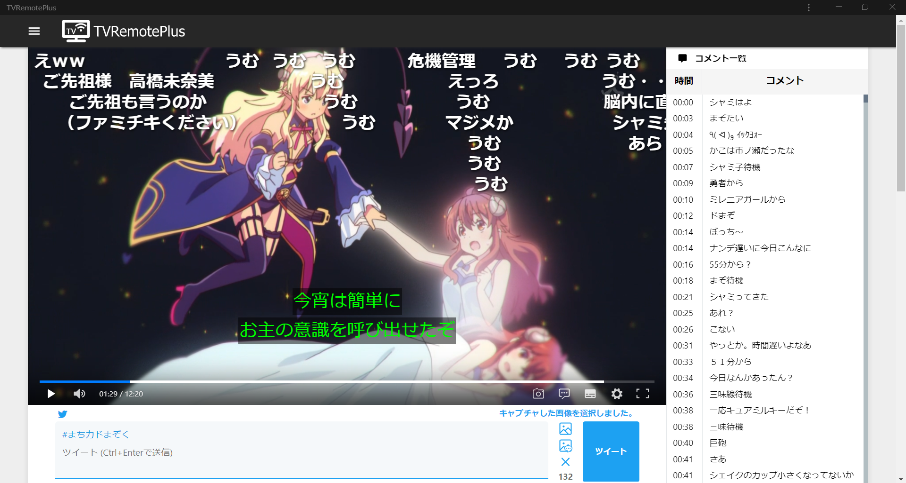
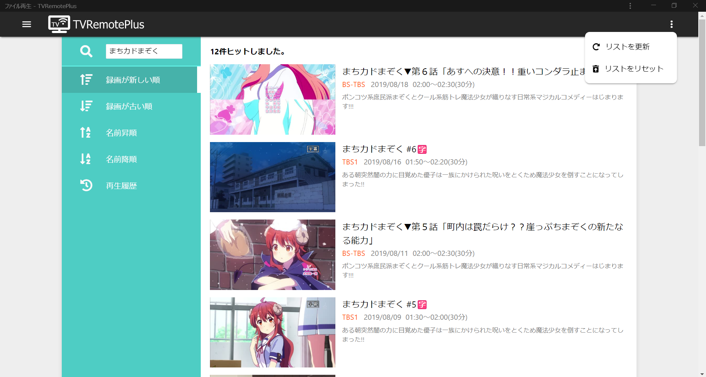
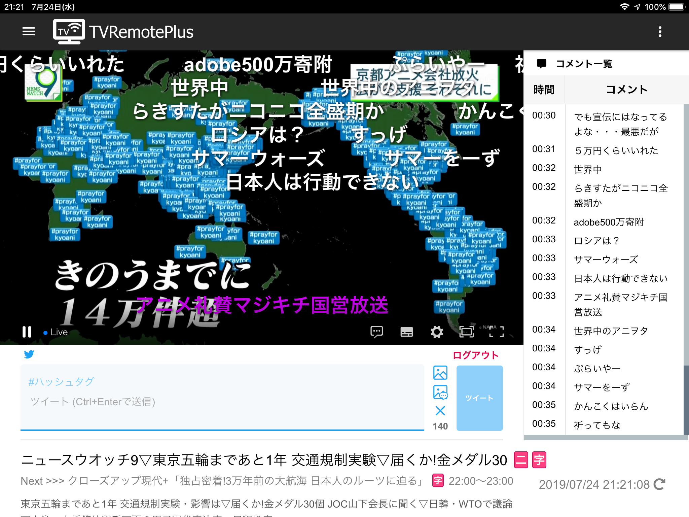
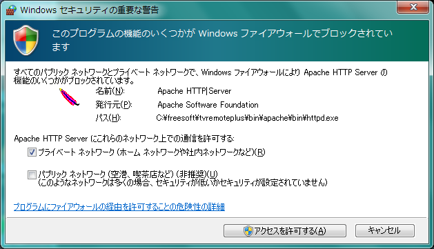
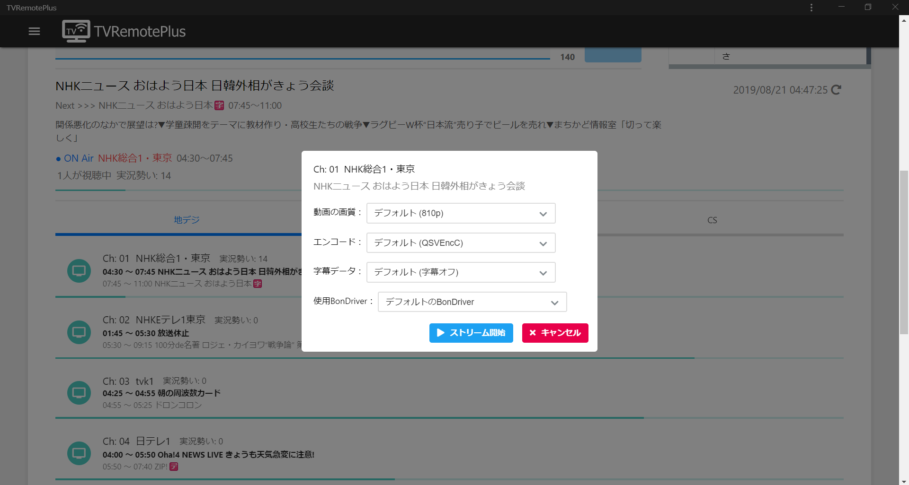

# 

PHP / JavaScript 製のテレビのリモート視聴ソフト（いわゆるロケフリ）です  
YouTube やニコニコなどの動画配信サービスの UI を意識した、モバイルフレンドリーなレスポンシブ Web インターフェイスが特徴です  
Twitter と連携してツイートをキャプチャ付きで投稿する機能や、ニコニコ実況のコメントを表示/投稿する機能、字幕の再生機能、録画番組の検索/再生機能なども実装しています

## [ダウンロードはこちら](https://github.com/tsukumijima/TVRemotePlus/releases)

## 概要

スマホ・PC両方においての利用に最適化した使いやすいUIを求め、開発しました。  
一応、コンセプトは「動画配信サイト風の直感的で使いやすいレスポンシブ Web UI 」です。

機能的には TVRemoteViewer_VB と似ている部分がありますが、下記のように TVRemoteViewer_VB にはない機能、逆にこの TVRemotePlus にはない機能もあります。  
また、TVRemotePlus は複数のオープンソースソフトウェア（組み込み済み）を利用して動作します。単体では動作しません。  
この他、当然ながら **予め、いわゆる TS 抜き環境が導入されている必要があります。** 

基本的にド素人が作った出来の悪い自己満ソフトのおすそ分けです。出来る範囲で不具合修正はしますが、動かなくても知りません。  
また、動けばいいや、程度でかなり強引に実装してしまっているため、色々不具合があるかもしれません…

### 開発動機
「布団でゴロゴロしながらスマホでようつべみたいにテレビとか録画とか見たい」  
「ニコ生みたいにニコニコ実況のコメントを流したいしコメントもしたい」  
「Twitter 実況するの割と手順が煩雑になりがちだし見ながら Twitter で実況したい」  
「折角 Twitter 実況するならテレビの画面もキャプチャしてツイートしたい」  
「録画見るときにもコメント流したいしようつべみたいに簡単に見たい（ファイル漁りたくない）」  
「字幕流して放送画面と一緒にキャプチャしてクソリプ画像を量産したい」  

などなど…（不純が過ぎる）

## 機能

細かなものまで列挙しています。  
（要設定）とあるものは予め設定が必要な機能です。  
（予定）とあるものは現在実装出来ていないものの、今後実装する予定のある機能です。  
環境によっては正常に動かない場合もあるかもしれません…

### 放送中・録画番組の視聴
- **基本**
  - HLS 形式による動画配信
  - 番組タイトルの表示
  - EDCB の API を利用した番組情報の表示（要設定）
  - EDCB の API を利用した放送中の他チャンネルの番組情報の表示→視聴（要設定）
  - EDCB の API を利用した放送中の他チャンネルのプログレスバーの表示
  - 番組時間の表示
  - チャンネル名の表示
  - 現在時刻表示（時計）
  - 視聴人数の表示
  - PWA対応（ホーム画面に追加することでネイティブアプリのように利用可能）（要設定）
  - ピクチャーインピクチャー対応
    - 非常に新しい技術のため、対応ブラウザは現状 PC 版 Chrome のみです
    - Android 8.0 以降の端末であれば、全画面で再生させた後ホームボタンを押すと自動的にピクチャーインピクチャーモードになります
  - basic認証設定（要設定）
  - ストリーム起動監視（予定）
  - ブラウザからの動作設定（予定）
  - 複数ストリームの同時配信（予定）
- **動画再生**
  - hls.js を利用したストリームのライブ配信
    - hls.jsの再生に対応していない iOS 端末を除き、諸々の互換性を維持するために  
    ブラウザ側で対応している場合にも全て hls.js を利用して再生させるようにしています
    - そのため、若干再生が重いです
  - フルスクリーンでの再生
  - Web フルスクリーンでの再生
  - 動画のスクリーンショットの保存（PC のみ）
  - b24.js を利用した字幕の表示
    - b24.js は EPGStation にて字幕表示に利用されている js 製ライブラリです
      - 後述の DPlayer に組み込んだ状態でお借りしています
    - hls.js を字幕表示に利用する関係で、hls.js も b24.js 対応のものを利用しています
      - そのため hls.js が使えない iOS 端末では字幕表示機能が利用できません
    - QSVEnc では非対応でしたが、バージョン3.24より対応して頂きました（この場で御礼申し上げます）
  - ニコニコ実況のコメントの再生・投稿（後述）（要設定）
  - 配信休止時の「配信休止中…」動画の再生
  - 配信準備時の「配信準備中…」動画の再生
  - 生放送の同期(● live ボタンを押すと同期されます)
- **動画配信**
  - TSTask を利用したテレビ放送の受信
  - ffmpeg・QSVEncC でのエンコード
  - チャンネルの設定
  - 動画の画質の設定
  - 字幕データの設定
  - 使用 BonDriver の設定
  - コマンドプロンプトからのストリーム開始（隠し機能）
- **録画番組の再生**
  - YouTube 風の視聴動画選択画面
  - 録画番組の並べ替え(新しい順・古い順・名前昇順・名前降順)
  - 録画番組の検索
  - 録画番組リストの更新
    - 更新する事で最新の録画番組がリストに反映されるようになります
  - ffmpeg を利用した録画番組のサムネイルの表示
  - rplsinfo を利用した録画番組のタイトルの表示
  - rplsinfo を利用した録画番組の番組情報の表示
  - rplsinfo を利用した録画番組の番組時間の表示
  - 再生履歴の表示
  - 画質を選択して再生
  - ffmpeg・QSVEncC でのエンコード
  - ニコニコ実況の過去ログの再生（要設定）（後述）
  - エンコード動画のダウンロード（予定）

### Twitter へのツイート投稿
- **Twitter へのツイート投稿（ TwitterAPI を利用します）（要設定）**
  - テレビを見ながらキャプチャ付きで Twitter 実況が可能です
  - 予め config.php に TwitterAPI のコンシューマーキーなどを記入しておく必要があります
  - Twitter ログイン・ログアウト機能
  - ツイートの投稿
  - ハッシュタグ付きツイートの投稿
  - ハッシュタグを1分以内に TwitterAPI 経由で連投するとほぼ確実に Twitter 側からシャドウバンされるため、  
  ハッシュタグ付きツイートをしてから1分以内にハッシュタグ付きツイートをした場合に、  
  ハッシュタグを除去してシャドウバンを防止する機能
  - クリップボード内の画像の貼り付け
    - Ctrl + V で出来ますがあまり意味のない隠し機能です
  - Tab キーによるツイート入力画面のフォーカス
    - これも隠し機能です、動くか微妙
  - 動画のキャプチャ付きツイートの投稿
    - Alt + 1 キーでキャプチャできます
    - Mac の場合は Option + 1 キーです
  - ニコニコ実況を含めた動画のキャプチャ付きツイートの投稿
    - Alt + 2 キーでキャプチャできます
    - Mac の場合は Option + 2 キーです
  - ハッシュタグ以外のツイート文や画像などの一括リセット
    - Alt + 3 キーでリセットできます
    - Mac の場合は Option + 3 キーです
  - 字幕を含めた動画のキャプチャ付きツイートの投稿
    - 字幕表示時のみキャプチャの中に含めます

### ニコニコ実況の再生・投稿
- **ニコニコ実況のコメントの再生**
  - ニコニコ生放送のようにコメントが動画上に流れます
  - 本家のコメントの色・位置を再現
  - DPlayer を利用したコメントの表示
    - DPlayer は OSS の JS 製多機能動画プレイヤーです
      - TVRemotePlus 向けに諸々かなり改造を加えた上でお借りしています
      - [こちらのリポジトリ](https://github.com/tsukumijima/DPlayer)に置いてあります
  - DPlayer を利用したコメントの表示・非表示の切り替え
  - DPlayer を利用したコメントの透明度の切り替え
  - ニコニコ実況の勢いの表示
  - コメント一覧表示（ PC のみ）
    - ニコニコ生放送のようにコメントが一覧で流れていきます
    - 画面に流れるのはウザいがコメントは見たい、という場合におすすめです
    - コメント時間(ストリーム開始時から換算)の表示
    - コメント内容の表示
- **ニコニコ実況の過去ログコメントの再生（要設定）**
  - 予め config.php にニコニコ動画のメールアドレスとパスワードを記入しておく必要があります
  - 当然ながら録画番組再生時はコメントは出来ません
  - コメントの再生
  - コメント一覧表示（ PC のみ）
    - 過去ログ再生時は一気にコメント一覧にコメントが表示されます
    - コメント時間(動画の最初から換算)の表示
    - コメント内容の表示
- **ニコニコ実況へのコメントの投稿（要設定）**
  - ニコニコ動画への API ログイン → Cookie 取得
    - 予め config.php にニコニコ動画のメールアドレスとパスワードを記入しておく必要があります
  - コメントの色・位置の指定
  - XMLSocket によるニコニコ実況への投稿

## セットアップ

アーカイブは 64bit 版のみです。( BonDriver は 32bit・64bit 両方対応しています )  
技術的に 32bit 版も可能ですが、こちら側でアーカイブを作成するのが面倒なためです。（要望があれば公開するかもしれません）  

### 別途必要なソフト
 - **TVTest**
   - BonDriver の TVTest 用チャンネル設定ファイル（.ch2）が TSTask で必要なためです。
   - また、BonDriver も TVTest と同じものを利用できます。
   - （ないとは思いますが）チャンネルスキャンをしていない場合は、必ずしておいてください。
   - 動作確認済みのアーカイブは [こちら](https://github.com/tsukumijima/TS-Soft-Built/raw/master/TVTest-0.10.0-190808.zip) よりどうぞ。
 - **EDCB + EDCB_Material_WebUI**
   - 番組表の取得に利用します（なくても動作しますが、番組情報が取得できません）。
   - EDCB に加え、[EDCB_Material_WebUI](https://github.com/EMWUI/EDCB_Material_WebUI) を導入しておいてください（素の EDCB だけでは動きません）
   - この他、config.php にて EDCB_Matrial_WebUI の動作しているアドレスを設定する必要があります。
   - 動作確認済みのアーカイブ（ EDCB_Material_WebUI 同梱済み）は [こちら](https://github.com/tsukumijima/TS-Soft-Built/raw/master/EDCB-190721.zip) よりどうぞ。

### インストール & セットアップ

1. Release から最新の TVRemotePlus をダウンロード・解凍します。
2. 解凍したフォルダの中の install.bat を実行し、インストーラー通りに進めます（ CUI ベースですが、比較的簡単にインストール出来ると思います）。
3. 中の config.php （設定ファイル）を **UTF-8・LFが読み込めるテキストエディタ（メモ帳は出来るだけ避けて下さい）** で開き、内部の設定を自分の環境に合わせ変更します（必ず目だけでも通してください、そのままでは正常に動きません）。
4. 変更出来たら、**文字コード UTF-8・改行コード LF** で変更を保存します（ Shift-JIS 等 UTF-8 以外の文字コードで保存した場合、最悪動作しなくなります）。
5. 下の「 TwitterAPI 開発者アカウントの取得について」の項目を参考にし、Twitter API アカウントを取得し、アプリケーションを作成します。（既に Twitter API アカウントを持っている方、ツイート投稿機能を利用しない方は適宜ステップを飛ばして下さい。）  
その後、config.php を上の手順で開き、作成したアプリケーションのコンシューマーキー等を入力して下さい。
6. C:\（TVRemotePlusのあるフォルダ）\bin\TSTask\BonDriver\ フォルダに、いつも TVTest 等で使用している BonDriver と、.ch2 ファイル（チャンネル設定ファイル）を入れてください（ BonDriver は 32bit・64bit 両方対応しています、インストーラーでどちらかを指定してください ）。
7. 設定を終えたら、**デスクトップに追加された赤い羽根のショートカットをダブルクリックし、Web サーバーを起動します**（赤い羽根のアイコンの真っ黒なウインドウが立ち上がりますが、利用する際は立ち上げたままにしておいてください（最小化するのは構いません（デフォルトで最小化した状態で起動します）））。
8. ブラウザの URL 欄に **http://( TVRemotePlus の動いている PC のローカル IP アドレス):8000/ と入力し、TVRemotePlus の Web アプリへアクセスすると、使えるようになっているはずです。**
9. 後は適当に使ってください。（もしかするとエラーが出てうまく動かない場合があるかもしれませんが、ほとんどの場合、設定ミスによるものだと思います…）

### インストール時の注意
 - **インストールフォルダへのパスに日本語(全角文字)が含まれていると、正常に動きません。**
   - Webサーバー（Apache）や php が日本語フォルダに対応していないためです。
   - 例えば、 C:\テレビ\TVRemotePlus\ だとか C:\freesoft\ＴＶＲＰ\ はエラーになります。
   - C:\freesoft\TVRemotePlus\ のように、インストールフォルダへのパスが全て半角英字で完結するようにしてください。
 - **Web サーバー（Apache）のウインドウがすぐに閉じてしまう場合、何らかのエラーで Web サーバーが起動できていません。**
   - コマンドプロンプトを開き、先程のショートカットを黒いウインドウにドロップし、エラーログを確認してください。
 - **起動する際に下のようなファイアウォール云々が出た場合、許可しておいてください。**
   - 
   - 基本的にはプライベートネットワークのみの許可で構いません（ VPN 等を利用して外部からアクセスする場合は異なってくるかもしれません）。
 - **ブラウザでアクセスしようとすると「 CONNECTION REFUSED 」と出てアクセスできない場合は、Webサーバー（Apache）が起動しているかどうか確認してください。**
   - 赤い羽根のアイコンが Windows のタスクバーにない場合、起動できていないと思われます。
   - 起動しているのにアクセスできない場合は、URL 欄に打ち込んだ TVRemotePlus の動いている PC のローカル IP アドレスが正しいかどうか、確認してください。
   - また、適宜お使いのセキュリティソフトのファイアウォールにて、Webサーバー（Apache）とポート8000・8100へのアクセスを許可しておいてください。
 - install.bat 実行時に **「コンピューターにVCRUNTIME140.dll がないため、プログラムを開始できません。」と出る場合は、[こちら](https://www.microsoft.com/ja-jp/download/details.aspx?id=53587)より Visual C++ 2015 再頒布可能パッケージ をダウンロード・インストールしてください。**
   - vc_redist.x64.exe のみダウンロードし、ダウンロードが終わったら vc_redist.x64.exe を実行し、インストールしてください。
 - **TVRemotePlus は通常、ポート 8000・8100・8200～8210あたり を使用します。**
   - ポート 8000 … HTTP アクセス用
   - ポート 8100 … HTTPS アクセス用
   - ポート 8200～8210あたり … TSTask での UDP 送信に利用
   - ffmpge・QSVEncC といったエンコードソフトが落ちてしまう場合は、ポートがバッティングしている可能性があります。
     - HTTP・HTTPS アクセス用ポートは初回インストール時に変更可能です（ HTTPS アクセス用ポートは HTTP アクセス用ポート + 1000 になります）。
     - TSTask での UDP 送信用ポートは config.php にて変更可能です。
 - ストリーム開始フォームの チャンネル もしくは 使用BonDriver の項目が空の場合は、**TSTaskの中の BonDriver フォルダに** BonDriver や .ch2ファイル が入っているかを確認してください。
   - それでも読み込めていない場合、.ch2ファイルがこちらの想定しているものと違っている可能性があります（不具合報告していただけると助かります）。
   - TSTask.exe のあるフォルダに BonDriver や .ch2ファイル を置いた場合、認識されません。
 - サーバー PC にすでに php がインストールされていてシステム環境変数にも登録されている場合で、TVRemotePlus の php（7.3.6）とバージョンが異なっている場合、Apache（Webサーバー）がエラーウインドウを出して正常に起動できない事があるようです。
   - 既に入っている php へのパスがシステム環境変数に登録されていると、そちらの php の dll を優先して読み込もうとする（？）からか、php.exe と 関連　dll のバージョンが違うとそこでエラーが発生するようです…
   - できるだけ、既に入っている php はシステム環境変数から除外するか、既に入っている php を TVRemotePlus と同じバージョン（php7.3）に揃えるようにしてください。

## 使い方
- TVRemotePlus を起動する際は、デスクトップにある赤い羽根のアイコンをダブルクリックで起動させ、利用中はそのままにしておいてください。
- ブラウザの URL 欄に http://( TVRemotePlus の動いている PC のローカル IP アドレス):8000/ と入力し、TVRemotePlus の Web アプリへアクセスします。
  - 毎回打つのは面倒なため、ショートカットに登録しておくことをおすすめします。
- 左上のボタンを押すと、サイドメニューが開きます。
  - 現状、設定ボタンは実装出来ていません。
- 右上のボタンは、現状ファイル再生選択ページのみ、ファイルリストの更新に使用します。
  - ファイル再生機能は現状録画リストを自動で更新しないため、録画が増えたらこまめに右上のボタンより「リスト更新」し、録画リストに反映させてください。
- 隠し機能ですが、コマンドプロンプトに、
   - (TVRemotePlusをインストールしたフォルダ)\stream.bat ONAir (ストリーム開始するチャンネル番号)
     - と実行すると、指定したチャンネルが自動でストリーム開始されます。
   - (TVRemotePlusをインストールしたフォルダ)\stream.bat ONAir (ストリーム開始するチャンネル番号) (動画の画質) (エンコード) (字幕データ) (使用BonDriver)
     - のように、詳細に指定することもできます。
   - (TVRemotePlusをインストールしたフォルダ)\stream.bat Offline
     - と実行すると、自動でストリーム終了されます。
  - これを利用し、タスクスケジューラ等に登録しておくと、指定した時間に自動でストリームが起動/終了できるようになります。
- TVRemotePlus を終了する際は、赤い羽根のアイコンの黒いウインドウを閉じてください。

## PWAについて

PWA（ Progressive Web Apps ）とは、

 - **アプリアイコンをデスクトップやホーム画面に追加してそのショートカットから起動出来る**
 - **ブラウザバーを気にせず大きな画面で使える（上の画像を参照）**
 - **起動時に数秒スプラッシュ画面が表示される（ iOS・Android のみ）**
 
など、**Webアプリをローカルアプリのように利用できる新しい仕組みのことです。**  
有名なサイトでは Twitter（新 UI 版）が対応しています。  
TVRemotePlus は、PWA に対応しています。    

しかし、PWA を利用するためには、HTTPS 通信が必須です。そのため、インストール時に予め HTTPS 通信用の自己署名証明書（いわゆるオレオレ証明書）を作成・有効にしてあります。  
自己署名証明書を信頼させ、お使いの端末で PWA を利用するためには、端末に自己署名証明書自体をインストールさせておく必要があります。  
証明書のインストール後、TVRemotePlus と HTTPS でアクセス出来るようになれば、PWA 機能が利用出来るようになります。  
また、PWA は Windows・Mac・Android は Chrome 、iOS では Safari が対応しています。

### インストール手順
 - まず、PWAを利用したい端末で **http://( TVRemotePlus の動いている PC のローカル IP アドレス):8000/server.crt** にアクセスし、証明書をダウンロードします。
 - その後、ダウンロードした証明書を開き、端末にインストールします（この時、表示が「CA 証明書」になっているかどうかを確認してください）。
 - インストール後、Chrome または Safari が立ち上がっていれば一旦タスクを切ってからブラウザをもう一度起動します。
 - **https://( TVRemotePlus の動いている PC のローカル IP アドレス):8100/** にアクセスし、アドレスバーに鍵マークが正常についていれば、証明書の導入は完了です。
   - この時に必ず https:// を付けてアクセスしてください（ https:// を付けないと http:// と判定されてしまいエラーが出ます）
 - ブラウザのメニュー等から **「ホーム画面に追加」または「 TVRemotePlus をインストール」すると、ネイティブアプリのように利用できるようになるはずです。**
 - Android の場合、何故かスプラッシュ画面のアイコンが小さい場合がありますが、原因は不明です（ Chrome の自動推定のせいらしいですが…）

## TwitterAPI 開発者アカウントの取得について
長くなるため別ページにまとめています。  
[Twitter_Develop.md](docs/Twitter_Develop.md)

## 注意事項
 - 端末のスペックにもよりますが、基本的に処理が重たいです（コメント表示時は特に…）。コメントが多くなると固まる場合もあります…
   - コメントが多すぎて重い場合、プレイヤーの設定にてコメント表示をオフにすると軽くなります。
 - 現状、スペックやその時々の状況によっても変わりますが、仕様上ストリーム開始（チャンネル切り替え）に5～20秒程度掛かります…
 - エンコードソフトの仕様（？）で、字幕データオン時に字幕がない番組を配信させている場合、何故かエンコードが数秒止まる事があります。
   - そのため、再生時に数秒カクついているように見える場合があります。
   - 字幕のない番組を配信させる際は字幕データをオフにしておく事をおすすめします。
   - なお、録画番組再生時はそのような不具合は確認されていないため、常に字幕データをオンにしてエンコードさせるような仕様としています。
   - 字幕自体の表示はプレイヤーの設定で切り替えられます。字幕が要らない場合はオフにしてください。
 - 配信準備中…からストリームにうまく移らない・再生が止まった などの時は、時計表示をクリック・タップしてください。リロードされます。
 - TSTask は後述の無理やり taskkill させる関係上、クライアントプログラムを起動させないオプションで起動させています。
   - 立ち上がってるか心配な場合、タスクマネージャーで調べるか別途 TSTaskCentre を起動させるといいとおもいます。
   - ffmpeg・QSVEnc は独立ウインドウにて最小化した状態で起動します。
 - ニコニコ実況にコメントを投稿する場合、数秒遅延している事を念頭に入れた上でコメントしてください…（それほど気にならないとは思いますが…）
 - 同梱している動作に必要なソフトウェア（後述）は全て TVRemotePlus 向けに設定やフォルダ構成等を最適化してあります。

## 既知の問題
 - ストリームが起動しているかどうかを監視する機能を実装出来ていないため、ストリーム起動に失敗したかは PC のエンコーダーのログを見ない限り分からない
   - 何度リロードしても「配信準備中…」の動画が流れる場合、ストリーム起動に失敗している可能性が高いです
 - ストリームを終了させる際、ffmpeg・QSVEnc・TSTask 等を taskkill で強制終了させる雑な仕様なため、ストリーム起動時にffmpegなど別のソフトを利用している場合に突然ブッチされる
   - ストリーム配信/終了時は安全のため、同じPCにて ffmpeg 等のソフトを利用しない事をおすすめします

## 利用ソフトウェア
動作に必要なソフトウェアをお借りしています。この場で御礼申し上げます。  
全て配布アーカイブの中に組み込んでいますが、一部設定が必要な箇所があります。  
また、QSVEncC を利用する場合は Intel QSV に対応した CPU が必要です。

- Apache（ v2.4.39・Webサーバ）
- php（ v7.3.6・実行環境）
- TSTask（ v0.2.0(patch)・テレビ放送の受信、UDP 送信に利用）
- rplsinfo（ v1.5・TSファイル内の番組情報取得に利用）
- ffmpeg（ v4.1.1・UDP 受信 → エンコードに利用）
- QSVEncC（ v3.24・UDP 受信 → ハードウェアエンコードに利用）

## 動作環境
  - サーバー：**Windows7 以上（のはず）・64bit**
    - 32bit でも動くとは思いますが、恐らく 64bit の環境が殆どだと思います。
    - そのため、配布アーカイブに同梱されているソフトは全て 64bit 版で組み込んでいます。
    - Linux 版はこちらに環境がないので難しいですが、Web ベースなので移植する事自体は可能だと思います。
  - クライアント：**最新の Chrome・Firefox・Safari など**
    - **Chrome を強く推奨します。**
    - Opera・Vivaldi などはブラウザエンジンが Chrome（ Blink ）なので Chrome とみなします。
    - 当然ながら **IE と Edge はサポートしていません。**（滅びろ） 
    - iOS 端末ではブラウザエンジンが Safari 以外利用できないらしく、  
    一部正常に動作しない機能があります。
      - iOS 版 Chrome・Firefox の内部ブラウザエンジンは Safari です。
    - キャプチャ付きツイートの投稿機能は、**Android 版 Firefox・Mac 版 Safari では対応していません。**（ブラウザのバグによるエラーでキャプチャに失敗します）
      - 動画のキャプチャはブラウザの仕様に依存する上、ブラウザ側のバグが非常に多いため、基本的に最新の Chrome を利用してください。
    - 古い Android 端末では、コメント描画が重くなる場合があります。
      - このため、コメント描画中にキャプチャする場合、キャプチャ画像の取得に時間がかかる場合があります。
      - 最新の端末でも、（スペックにもよりますが）コメントが多い場合はキャプチャ画像の取得に時間がかかる場合があります。

## 動作確認
  - サーバー：Windows7 Professional 64bit + PLEX PX-Q3PE4
    - PX-Q3PE4 の兄弟機種である PX-W3PE4・PX-W3U4・PX-Q3U4 でも同様に使えると思います。
    - PT 系はこちらに環境がないので微妙です…
    - 首都圏での利用を前提で開発しています。
      - （確かめようがないのですが）もしかすると、地方では一部動作しない箇所があるかもしれません…
    - CS はこちらに環境がないので基本的に動作対象外とさせて頂きます。（ソースを弄れば出来るかもしれません）
  - クライアント：
    - Windows・Mac
      - Chrome  
    - Android
      - Chrome
      - Opera  
    - iOS
      - Safari
      - Chrome  

## その他
詳しくない方でも出来るだけ簡単にセットアップ出来るようにしたつもりですが、  
ソフトの性質上、どうしても一部難しい箇所や環境によってうまく動かない箇所があるかもしれません…

また、このソフトを利用して起こったいかなる不利益も、当方は一切の責任を負いかねます。あくまで自己責任にて利用してください。  
改変・再配布等はお好きにどうぞ（改変ソースは個人的に取り入れる事があります）。  
Issue か 5ch のロケフリスレ にて不具合報告などは受け付けておきます。

## License
[MIT Licence](LICENSE.txt)