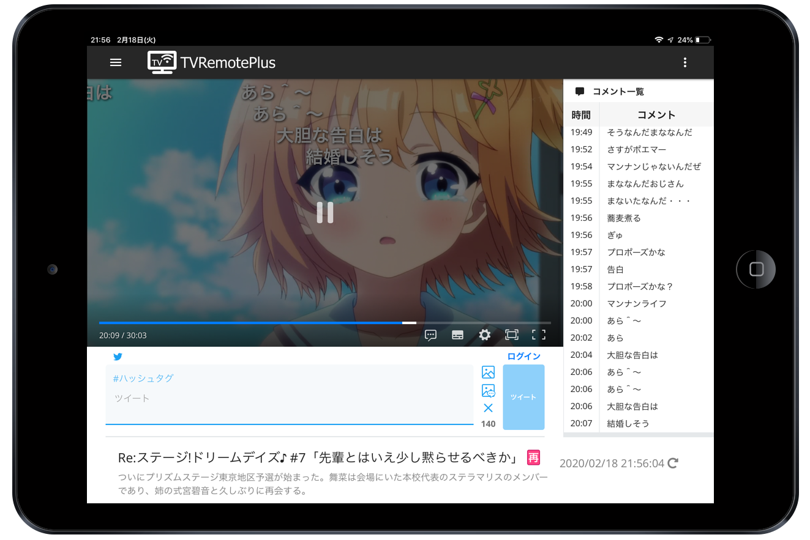

# 

PHP / JavaScript 製のテレビのリモート視聴ソフト（いわゆるロケフリ）です  
YouTube やニコニコなどの動画配信サービスの UI を意識した、モバイルフレンドリーなレスポンシブ Web インターフェイスが特徴です  
放送中の番組の視聴・録画番組の検索 / 再生・複数同時配信などの基本機能に加え、Twitter と連携してツイートをキャプチャ付きで投稿する機能や、  
ニコニコ実況のコメントを表示 / 投稿する機能、字幕を表示する機能なども実装しています

## [ダウンロードはこちら](https://github.com/tsukumijima/TVRemotePlus/releases)
## 概要

＊画像はイメージです

- [概要](#概要)
  - [開発動機](#開発動機)
- [機能](#機能)
- [セットアップ](#セットアップ)
  - [別途必要なソフト](#別途必要なソフト)
  - [インストール & セットアップ](#インストール--セットアップ)
  - [トラブルシューティング](#トラブルシューティング)
- [使い方](#使い方)
- [PWA について](#pwaについて)
  - [PWA のインストール手順](#PWA-のインストール手順)
- [Chromecast（Google Cast）機能について](#chromecastgoogle-cast機能について)
  - [注意](#注意)
  - [Chromecast 機能の使い方](#chromecast-機能の使い方)
- [TwitterAPI 開発者アカウントの取得について](#twitterapi-開発者アカウントの取得について)
- [リバースプロキシで外出先からアクセスする（上級者向け）](#リバースプロキシで外出先からアクセスする上級者向け)
- [注意事項・既知の問題](#注意事項既知の問題)
- [利用ソフトウェア](#利用ソフトウェア)
- [動作環境](#動作環境)
- [動作確認](#動作確認)
- [寄付について](#寄付について)
- [その他・謝辞](#その他謝辞)
- [Release Notes](#Release-Notes)
- [License](#License)

スマホ・PC両方においての利用に最適化した使いやすいUIを求め、開発しました。  
一応、コンセプトは「動画配信サイト風の直感的で使いやすいレスポンシブ Web UI 」です。

機能的には TVRemoteViewer_VB と似ている部分がありますが、下記のように TVRemoteViewer_VB にはない機能、逆にこの TVRemotePlus にはない機能もあります。  
また、TVRemotePlus は複数のオープンソースソフトウェア（組み込み済み）を利用して動作します。単体では動作しません。  
この他、当然ながら **予め、いわゆる TS 抜き環境が導入されている必要があります。** 

基本的にド素人が作った出来の悪い自己満ソフトのおすそ分けです。出来る範囲で不具合修正はしますが、動かなくても知りません。  
また、動けばいいや、程度でかなり強引に実装してしまっているため、色々不具合があるかもしれません…

### 開発動機
「布団でゴロゴロしながらスマホでようつべみたいにテレビとか録画とか見たい」  
「ニコ生みたいにニコニコ実況のコメントを流したいしコメントもしたい」  
「Twitter 実況するの割と手順が煩雑になりがちだし見ながら Twitter で実況したい」  
「折角 Twitter 実況するならテレビの画面もキャプチャしてツイートしたい」  
「録画見るときにもコメント流したいしようつべみたいに簡単に見たい（ファイル漁りたくない）」  
「字幕流して放送画面と一緒にキャプチャしてクソリプ画像を量産したい」  

などなど…（不純が過ぎる）

## 機能

ざっくりにするつもりがかなり雑多になってしまった…  

太字のところが大まかな機能（このソフトでできること）です。  
（実装予定）とあるものは現在実装出来ていないものの、今後実装する予定のある機能です。  

 - **放送中のテレビが見れます**
   - BS・CS も見れます
   - YouTube Live とかニコ生を見るような感覚で見れると思います
   - **ピクチャーインピクチャーにも対応しています**
     - 対応しているブラウザは現状最新の PC 版・Android 版 Chrome（ Android 8.0 以降）のみです
     - 画面の端においたミニプレイヤーでテレビを見ながら他の作業をする、といった事ができるようになります
     - Android 8.0 以降で最新版の Chrome を使っているのにボタンが出てこない場合は、アドレスバーに chrome://flags と入力し、  
       出てきた検索窓から Picture-in-Picture と検索すると Picture-in-Picture Web API For Android という項目があるので、  
       Default となっているところを Enabled にし、Chrome を再起動するとボタンが出てくるはずです
       - まだ実験段階だからか、Default 状態では環境によって有効になったり無効になったりしているみたいです
   - **プレイヤーを全画面（フルスクリーン）にする事ができます**
     - 普通のフルスクリーンとブラウザフルスクリーンがあり、後者はプレイヤーがブラウザの描画画面いっぱいに広がります
     - Android の場合、普通のフルスクリーンにすると画面が自動で横向きになります
       - iOS 端末は Screen Orientation API に対応していないため非対応です
     - iOS 端末では Safari の仕様で全画面にするとブラウザデフォルトのプレイヤーが使用されます
       - そのため、コメントを表示させたい場合はブラウザフルスクリーンを使うようにしてください
       - iPadOS ( iOS13 以降の iPad ) では フルスクリーンがサポートされたため、全画面にしても通常のプレイヤーで再生できるようになっています
     - スマホなどのスペックの低い端末では、普通のフルスクリーンにするとコメント描画が非常に重くなる場合があります
       - 原因はよくわかりませんが、ブラウザフルスクリーンにすることでかなり改善することができます
       - 動作が極端に重い場合、Android の設定から［ユーザー補助サービス］が ON になっているアプリを全て OFF にしてみると軽くなることがあります
         - Chrome とユーザー補助サービスの相性が悪いらしく、Firefox ではこの現象は起こりません
   - **生放送の場合は、プレイヤーの ● Live ボタンを押すと同期できます**
     - 仕組み上どうしても遅延してしまうのですが、このボタンを押せば遅延を最小限にする事ができます
   - **再生中の番組のスクショを保存できます（ PC のみ）**
     - プレイヤーのスクリーンショットボタンを押すとダウンロードできます
     - これとは別に、再生中の番組をスクショして Twitter に投稿できる機能もあります（後述）
   - **エンコードには ffmpeg・QSVEncC・NVEncC・VCEEncC が利用可能です**
     - 全て同梱済みのため、改めてダウンロードする必要はありません
     - QSVEncC・NVEncC・VCEEncC を選択すると高速にエンコードできます（＝本放送との遅延が少なくなる）が、それぞれ対応した GPU が必要になります
   - **デフォルトで使う BonDriver を設定できます（設定しておけば毎回 BonDriver を選ぶ必要がありません）**
     - デフォルトの BonDriver は地デジ用・BS/CS 用でそれぞれ設定できます
     - ストリーム開始時にはデフォルト以外の BonDriver も選択できます
       - 選択できる BonDriver は地デジなら地デジ用 BonDriver（_T*.dll）、BS/CS なら BS/CS 用 BonDriver（_S*.dll）と無印 BonDriver（それ以外） になります
   - 現在の視聴人数を表示できます
     - 視聴人数は端末ごとにカウントされます
   - 長時間再生していると突然エンコードが止まってしまう事があるため、20秒経ってもストリームが更新されていない場合は自動でストリームを再起動します
   - ストリーム開始に失敗した（30秒経ってもストリームが更新されない）場合は、自動でストリームを終了し配信休止中の状態に戻ります
     - 何度試してもストリーム開始に失敗するときに無限ループにならないようにするためです
   - 動画プレイヤーには [DPlayer](https://github.com/MoePlayer/DPlayer) という JavaScript 製プレイヤーを TVRemotePlus 向けにかなり改良を加えた上でお借りしています
     - フォークは [こちらのリポジトリ](https://github.com/tsukumijima/DPlayer) に置いてあります
  - **複数のストリームを同時に配信できます**
    - **ライブ配信を同時配信して2つのチャンネルを行き来したり、時間のかかる録画ファイルのエンコードをライブ配信を見ている間に行わせておく、といったことができます**
    - 今視聴しているストリームを終了するにはサイドメニューの［このストリームを終了］ボタンを、  
      今視聴しているストリームも含め全てのストリームを終了したい場合は［全てのストリームを終了］ボタンをそれぞれクリック or タップしてください
    - ストリーム番号の指定がない場合、ライブ配信の場合は現在視聴しているストリームで、ファイル再生の場合は空いているストリームでそれぞれストリームを開始します
    - デフォルトは Stream 1・2・3・4 の4ストリームが用意されており、4ストリーム全て使い切っているときのみ Stream 5 以降が順次利用可能になります
    - それぞれのストリームをクリック or タップすると、そのストリームの視聴画面に遷移します
    - 赤いストリーム終了ボタンをクリック or タップすると、そのストリームのみストリーム終了することができます
    - ストリームが Offline になった場合は、自動でストリーム一覧から消去されます
  - 録画してる番組の放送時間が近くなったら通知でお知らせします（実装予定）
 - **録画した番組も見れます**
   - TS ファイル・mp4 ファイル・mkv ファイルの再生に対応しています
   - YouTube のような感覚で録画番組を再生できます
   - **録画番組の名前順・日付順のソートができます**
     - 録画が新しい順・録画が古い順・名前昇順・名前降順で並び替えができます
   - **再生履歴を表示できます**
     - 再生履歴の保存件数は設定から変更できます（デフォルトは10件です）
   - **番組のタイトルでキーワード検索することもできます**
     - 検索結果も 録画が新しい順・録画が古い順・名前昇順・名前降順で並び替えできます
   - TS ファイルを mp4 ファイルにエンコードする事ができます（実装予定）
   - **mp4 ファイルはプログレッシブダウンロード機能が使えます**
     - エンコードせずに生の mp4 ファイルをそのまま再生する事ができる機能です
     - 最初から最後まで再生できる・再エンコードしないのでそのままの画質で再生できる・再生が安定している などのメリットがあります
     - 一方、ブラウザが対応していない H.265 などのコーデックでエンコードされている場合は映像が再生出来ない場合があります
     - H.264（いつもの）であればどのブラウザでも再生可能です
   - 初回インストール時のみ、リスト更新に時間がかかることがあります
     - これは大量のサムネイルや番組情報をバックグラウンドで生成しているためです
     - リスト更新処理はバックグラウンドで動くため、タブを閉じても問題ありません
     - 初回インストール時点での録画ファイルの量が多いほど、リスト更新に時間がかかります
     - 初回のリスト更新が終われば、今後はリスト更新に時間がかかることはありません
       - 長くても10秒程度で終わるはずですが、長い間ファイル再生ページを開かなかった場合は処理するファイルも増えるため少し時間がかかることもあります
   - ファイルリストの内容がおかしくなった場合は、右上のメニューから「リストをリセット」をクリック・タップすると、リストをリセットできます
     - ページをリロードすると自動で再度リスト更新が始まります
     - 番組情報は再度取得し直しますが、サムネイルはリセットされません
     - また、再生履歴もリセットされます
 - **最近流行りのダークモードにできます**
   - 個人設定から［ダークモード］をオンにして、一旦リロードするとダークモードに変わります
   - 割とカッコよくて良いと思います（私はいつもダークモードで使っています）    
 - **ニコニコ実況のコメントが流せます**
   - ニコニコ実況機能を使う場合は、予めニコニコアカウントのメールアドレスとパスワードを設定しておく必要があります
   - うざかったらプレイヤーの設定からオフにできます
   - 色コメや上・下固定にも対応しています
     - 改造元の動画プレイヤーの兼ね合いで文字サイズだけは今のところ再現できていません…すみません…
   - コメントの透明度も調整できます
     - コメントが多すぎて動画が見れないときにおすすめです
   - 「コメントを無制限に表示」をオフにするとめちゃくちゃコメントが多くなったとき（例：バルス）にコメントを間引きして気持ちコメント描画を軽く出来ます（後述のファイル再生時は未対応）
   - ニコニコ実況にコメントを投稿することもできます
     - 当然ですがファイル再生時はコメントを投稿できません（失敗します）
 - **Twitter 実況が簡単にできます**
   - Twitter 実況機能を使う場合は、予め TwitterAPI の開発者申請をしておく必要があります（[詳しくはこちら](docs/Twitter_Develop.md)）
   - **動画プレイヤーの下にあるフォームから番組を見ながら Twitter 実況できます**
     - ハッシュタグ欄に番組のタグを書いておけばツイート投稿後にハッシュタグが消えない（いちいち再入力する必要がない）親切設計（？）
   - **放送中の番組をスクショ（キャプチャ）して画像つきでTwitterに投稿できます**
     - さらにニコニコ実況のコメントもつけて投稿することもできます
     - 字幕（後述）をオンにしているときは字幕も一緒にに合成されます
       - クソリプ画像発掘などにご利用ください（おい）
   - Twitter に投稿したスクショ画像はデフォルトでは (TVRemotePlus)/htdocs/tweet/upload/ に保存されます
     - 設定から画像の保存場所を変えることもできます
       - TVTest のキャプチャ保存フォルダと同じにするといいかも
     - どんどん画像が溜まるのが嫌な場合、投稿後に画像を削除するよう設定することもできます
   - ハッシュタグを1分以内に TwitterAPI 経由で連投するとほぼ確実に Twitter 側からシャドウバンされるため、1分以内にハッシュタグ付きツイートを連投した場合にハッシュタグを除去してシャドウバンを防止する機能もついています（長い…）
     - 必要ない場合は設定からオフにすることもできます
 - **字幕を表示できます**
   - EPGStation で利用されている [b24.js](https://github.com/xqq/b24.js) を使い字幕を表示しています
     - このライブラリがなければまず実装できませんでした、本当にありがとうございます
   - 字幕は、ストリーム開始時に字幕をオンにした場合にのみ表示できます
   - 別途プレイヤー側で字幕のオン・オフを設定できます
   - ストリーム開始時のデフォルト設定では生放送時は字幕オフ、ファイル再生時は字幕オンになっています
     - 本当は字幕を常時オンにしてプレイヤー側で切り替えるのが理想なのですが、字幕をストリームに含めてエンコードさせる場合、生放送の場合は CM に入ったときに何故かエンコードが遅くなって飛び飛びになったり、ファイル再生の場合はごく稀に字幕をストリームに含めたことが原因で途中でエンコードに失敗してしまったりする症状があるため、やむを得ずこのような形にしています
     - 生放送時は字幕付きで見たい番組だけ字幕オンにした上でストリーム開始することをおすすめします
     - ファイル再生時は途中でエンコードに失敗してしまう場合のみ字幕オフにしてストリーム開始することをおすすめします
   - ブラウザ側の実装の問題で、Firefox では字幕の色が再現できません…
     - 字幕を表示したい場合は Chrome を使うことをおすすめします
   - また、iOS では Safari が Media Source Extension API に対応していない関係で、字幕は表示できません
   - iPadOS ( iOS13 以降の iPad ) では Media Source Extension API に対応しているため字幕を表示できます
 - **ネイティブアプリのように使うことができます（ PWA 機能・[後述](#pwaについて)）**
   - PWA は、Web アプリをあたかもネイティブアプリのように使えるようにすることが出来る新しい仕組みのことです
   - インストールするとアプリアイコンから TVRemotePlus を起動できるようになるほか、ブラウザのアドレスバーが表示されないためより見やすくなります
   - PWA 機能を利用する場合は、予め各端末に自己署名証明書をインストールし、HTTPS で TVRemotePlus にアクセスできる状態にする必要があります（後述）
 - **Chromecast などにキャストする事ができます（暫定実装・[後述](#chromecastgoogle-cast機能について)）**
   - Google Cast に対応しているので、Chromecast 以外にも Google Home（音声のみ）や Google Nest Hub・AndroidTV などにもキャストできると思います
   - 現状コメントや字幕は表示できませんが、PC で録画した番組をテレビの大画面で見ることができるようになります
   - 手元のスマホにはコメントや字幕が流れるので、スマホを時々見ながらテレビで録画番組を見るのもありかもしれません
 - **Basic 認証も（一応）できます**
   - おまけ機能で作者も使っていないので、一部の機能が動かないこともあるかもしれません
   - セキュリティ的な面では弱い認証形式です・気になる方は適宜他の対策を取ってください
   - デフォルトでは Basic 認証機能はオフになっています・利用する場合は環境設定からオンにしてください
   - デフォルトのユーザー名は user 、パスワードは password になっていますが、Basic 認証機能を使う場合は必ず変えるようにしてください
 - **リバースプロキシを使い外部から視聴できるようにする事もできます（上級者向け・詳しくは [こちら](docs/Reverse_Proxy.md) ）**
   - 上級者向けですが、Apache や nginx などの Web サーバーに用意されているリバースプロキシ機能を使えば、外部から https://example.com/tvrp/ のような URL で TVRemotePlus にアクセス出来るようにすることもできます
   - 基本的にはセキュリティの面から VPN 経由でアクセスする事をおすすめしますが、この方法であれば速度低下や手間がかかるといった VPN のデメリットがなくなります
     - その代わり、設定を誤ると PC がセキュリティ的に無防備になる可能性もあります、十分細心の注意を払って設定してください
     - また、Web サーバーやネットワークの基本的な知識がない方にはおすすめできません
     - セキュリティ向上のため、Basic 認証なしで利用する場合は［リバースプロキシからのアクセス時に環境設定を非表示にする］の設定をオンにしておくことをおすすめします
       - 設定ページに不正なリクエストを送信されてしまった場合、最悪 PHP の各種関数や Windows のコマンドが実行出来てしまう可能性があります
       - 脆弱な部分は修正したつもりですが、リバースプロキシからのアクセス時は環境設定を保存できないようにすることで、リスクを大幅に減らすことができます
     - この他、Basic 認証をオンにするなど、各自でセキュリティ対策を行ってください
     - リバースプロキシ自体のセットアップ方法はここでは割愛します
 - **キーボードショートカット**
   - スペースキー … 再生 / 一時停止
   - → キー … 5秒早送りする
   - Ctrl (or Command) + → キー … 15秒早送りする
   - Shift + → キー … 30秒早送りする
   - Alt (or Option) + → キー … 60秒早送りする
   - ← キー … 5秒巻き戻しする
   - Ctrl (or Command) + ← キー … 15秒巻き戻しする
   - Shift + ← キー … 30秒巻き戻しする
   - Alt (or Option) + ← キー … 60秒巻き戻しする
   - ↑ キー (プレイヤーにフォーカスした状態) … 音量を 10% 上げる 
   - ↓ キー (プレイヤーにフォーカスした状態) … 音量を 10% 下げる
   - F キー … 全画面のオン/オフを切り替える
   - W キー … ブラウザ全画面のオン/オフを切り替える
   - P キー … ピクチャーインピクチャーのオン/オフを切り替える（ブラウザが対応している場合のみ）
   - S キー … ストリームを同期する（ライブ配信時のみ）
   - C キー … コメント入力フォームを表示・フォーカスする
   - Tab キー … ツイート入力フォームにフォーカスする/フォーカスを外す
      - ツイート入力フォームにフォーカスしているときは上記の英字キー（ F・W・P・S・C キー）のキーボードショートカットが効きません
      - 英字キーのキーボードショートカットを使う場合、一旦 Tab キーを押してツイート入力フォームへのフォーカスを解除してください
   - Alt (or Option) + 1 キー … ストリームをキャプチャする
   - Alt (or Option) + 2 キー … ストリームをコメント付きでキャプチャする
   - Alt (or Option) + 3 キー … ハッシュタグ以外のツイート・画像のリセット
   - Ctrl + V キー (ツイート入力フォームにフォーカスした状態) … クリップボード内の画像をフォームに貼り付け

## セットアップ

アーカイブは 64bit 版のみです。（ BonDriver は 32bit・64bit 両方対応しています）  
技術的には 32bit 版のアーカイブも可能ですが、こちら側でアーカイブを作成するのが面倒なためです。（要望があれば公開するかもしれません）  

### 別途必要なソフト
 - アーカイブは [こちら](https://github.com/tsukumijima/DTV-Built/) に置いています。
 - **TVTest**
   - BonDriver の TVTest 用チャンネル設定ファイル（.ch2）が TSTask で必要なためです。
     - 32bit・64bit は問いませんが、古いバージョンの TVTest だとチャンネル設定ファイルのフォーマットが異なっているなどで動かないことがあるかもしれません。
     - TVTest 0.10.0 のチャンネル設定ファイルにて動作確認をしています。
     - .ch2 ファイルさえ用意できれば大丈夫です。
   - また、BonDriver も TVTest と同じものを利用できます。
   - （ないとは思いますが）チャンネルスキャンをしていない場合は、必ずしておいてください。
   - 動作確認済みのアーカイブは [こちら](https://github.com/tsukumijima/DTV-Built/raw/master/TVTest-0.10.0-200202.zip) よりどうぞ。
 - **EDCB + EDCB Material WebUI**
   - 番組表の取得に利用します（なくても動作しますが、番組情報が取得できません）。
   - EDCB に加え、[EDCB Material WebUI](https://github.com/tsukumijima/EDCB_Material_WebUI) を導入しておいてください（素の EDCB だけでは動きません）
   - この他、設定ページにて EDCB Matrial WebUI の API が動作している URL を設定する必要があります。
   - TVRock 等を利用している場合は、別途 TVRemoteViewer 2.93m（再うｐ）版を導入し、その URL を設定することで番組表が取得出来るようになります（対応していただき感謝です）。 
   - 動作確認済みのビルド済みアーカイブ（ EDCB Material WebUI 同梱済み）は [こちら](https://github.com/tsukumijima/DTV-Built/raw/master/EDCB-200209.zip) よりどうぞ。

### インストール & セットアップ

1. **Release から最新の TVRemotePlus をダウンロード・解凍する**
2. **解凍したフォルダの中の install.bat を実行し、インストーラー通りに進める**
   - CUI ベースですが、比較的簡単にインストール出来ると思います
   - 後述しますが、半角スペースの入ったパス、日本語（マルチバイト文字）の入ったパスにインストールするのはできるだけ避けてください
3. **下の [TwitterAPI 開発者アカウントの取得について](#twitterapi-開発者アカウントの取得について) の項目を参考にし、Twitter API 開発者アカウントを取得し、アプリケーションを作成する（任意）**
   - その後、設定ページの［Twitter 投稿］から、作成したアプリケーションの Consumer Key などを入力してください
   - 既に Twitter API アカウントを持っている方、ツイート投稿機能を利用しない方は適宜ステップを飛ばしてください
4. **C:\（TVRemotePlusのあるフォルダ）\bin\TSTask\BonDriver\ フォルダに、いつも TVTest などで使用している BonDriver と、.ch2 ファイル（チャンネル設定ファイル）を入れる**
   - BonDriver は 32bit・64bit 両方対応しています、インストーラーでどちらかを指定してください
   - BonDriver は Spinel や BonDriverProxyEx 経由で使うと安定性が高くなります
     - Spinel よりも BonDriverProxyEx の方がストリーム開始までにかかる時間が3～5秒ほど速いです
     - BonDriverProxyEx のビルド済みアーカイブは [こちら](https://github.com/tsukumijima/TS-Soft-Built/raw/master/BonDriverProxyEx-1.1.6.6.zip) よりどうぞ
   - **B-CAS カードを PLEX 製チューナー付属の内蔵カードリーダーで利用している場合は、TVTest 等で使っている WinSCard.dll・WinSCard.ini を TSTask.exe と同じフォルダに入れてください**
     - ストリームの起動に失敗する or 再開 → 中断を繰り返す 場合はまずは WinSCard.dll・WinSCard.ini が配置されているかを確認してみてください
5. **デスクトップに追加された赤い羽根のショートカットをダブルクリックし、Web サーバーを起動する**
   - 赤い羽根のアイコンの真っ黒なウインドウが立ち上がりますが、利用する際は立ち上げたままにしておいてください
   - 最小化するのは構いません（デフォルトで最小化した状態で起動します）
6. **ブラウザの URL 欄に http://( TVRemotePlus の動いている PC のローカル IP アドレス):8000/ と入力し、TVRemotePlus の Web アプリへアクセスすると、使えるようになっているはずです**
7. **画面左上の ≡ サイドメニュー → 設定 → 環境設定 から、適宜必要な箇所を設定する**
   - 今は何も設定しなくても一応動くようにはなっていますが、できるだけ目だけでも通しておいてください
   - 番組表を表示する場合は、EDCB Material WebUI の API がある URL（通常は http://(EDCBをインストールしたPC):5510/api/ ）を［EDCB Material WebUI (EMWUI) の API がある URL］に設定してください
   - 以前同様に config.php（設定ファイル）を **UTF-8・LFが読み込めるテキストエディタ（メモ帳はできるだけ避けてください）** で開き、直で編集することも可能です
     - 変更出来たら、**文字コード UTF-8・改行コード LF** で変更を保存します（ Shift-JIS など UTF-8 以外の文字コードで保存した場合、最悪動作しなくなります）
8. **後は適当に使ってください…**
   - 比較的頻繁にアップデートします、できるだけ最新の TVRemotePlus を使うことをお勧めします
     - config.php（設定ファイル）は新機能が追加された場合などに変更される事があるため、アップデートでインストールすると動かない場合があります
     - その場合は一旦 config.php を新しいものに置きかえ、設定をやり直してください
   - もしかするとエラーが出てうまく動かない場合があるかもしれませんが、ほとんどの場合、設定ミスによるものだと思います…
   - PC 起動時に一緒に TVRemotePlus を起動させたい場合は、適宜デスクトップに作成されたショートカットをスタートアップフォルダにコピーし、スタートアップに登録してください
     - スタートアップフォルダはエクスプローラーの上のパス入力欄から `%AppData%\Microsoft\Windows\Start Menu\Programs\Startup` と入力すると開けます

### トラブルシューティング　

 - **インストールフォルダへのパスに日本語（全角文字）が含まれていると、正常に動きません。**
   - Webサーバー（Apache）や PHP が日本語フォルダに対応していないためです。
   - もしかすると動くかもしれませんが、基本的にお勧めしません…
   - **また、半角スペースのあるフォルダ（例：C:\Digital TV\TVRemotePlus ）も避けてください。**
    - 最近のアップデートでエラーにならないように一応修正しましたが、避けたほうが無難だと思います。
   - 例えば、 C:\テレビ\TVRemotePlus\ だとか C:\freesoft\ＴＶＲＰ\ はエラーになります。
   - C:\DTV\TVRemotePlus\ のように、インストールフォルダへのパスが全て半角英数字・半角スペースなしで完結するようにしてください。
 - **Web サーバー（Apache）のウインドウがすぐに閉じてしまう場合、何らかのエラーで Web サーバーが起動できていません。**
   - コマンドプロンプトを開き、先程作成されたショートカットを黒いウインドウにドロップして、エラーログを確認してください。
 - **起動する際に下のようなファイアウォール云々が出た場合、許可しておいてください。**
   - 
   - 基本的にはプライベートネットワークのみの許可で構いません（ VPN 等を利用して外部からアクセスする場合は異なってくるかもしれません）。
 - **チャンネル設定ファイルが見つからないため、ストリームを開始できません。と出る場合、TVRemotePlus 側でチャンネル設定ファイルが認識できていません。**
   - チャンネル設定ファイル（.ch2）のファイル名は地デジの場合 BonDriver_(機種名)_T(0-9).ch2、BS・CSの場合は BonDriver_(機種名)_S(0-9).ch2 である必要があります。
   - 例えば BonDriver_FSUSB2N.ch2 のように地デジのみのチューナーで _T や _S が付いていない場合は地デジ用か BS・CS 用か認識出来ないため、BonDriver_FSUSB2N_T.ch2、または BonDriver_FSUSB2N_T0.ch2 のようにしてください。
 - **ブラウザでアクセスしようとすると「 CONNECTION REFUSED 」と出てアクセスできない場合は、Webサーバー（Apache）が起動しているかどうか確認してください。**
   - 赤い羽根のアイコンが Windows のタスクバーにない場合、起動できていないと思われます。
   - 起動しているのにアクセスできない場合は、URL 欄に打ち込んだ TVRemotePlus の動いている PC のローカル IP アドレスが正しいかどうか、確認してください。
   - また、適宜お使いのセキュリティソフトのファイアウォールにて、Webサーバー（Apache）とポート8000・8100へのアクセスを許可しておいてください。
 - install.bat 実行時に **「コンピューターにVCRUNTIME140.dll がないため、プログラムを開始できません。」と出る場合は、[こちら](https://www.microsoft.com/ja-jp/download/details.aspx?id=53587)より Visual C++ 2015 再頒布可能パッケージ をダウンロード・インストールしてください。**
   - vc_redist.x64.exe のみダウンロードし、ダウンロードが終わったら vc_redist.x64.exe を実行してランタイムをインストールしてください。
 - **HTTPS 用 URL でアクセスしようとすると Bad Request と出てアクセス出来ない場合は、URL が本当に https:// になっているかどうか確認してください。**
   - Bad Request は、主に HTTPS（ https:// ）用の URL に HTTP（ http:// ）でアクセスしようとした際に起こるエラーです。
   - ちなみに HTTP 用の URL に HTTPS でアクセスしようとすると、「192.168.x.xx から無効な応答が送信されました。」のようなエラーが発生します。
 - **ストリームが正常に終了できない（チャンネルが変更できない）場合は、環境設定 → ［ストリーム終了時に TSTask を強制終了する］をオンにしてみてください**
   - この設定をオンにすると TSTask を taskkill /F で強制終了します
   - 通常の BonDriver を使うと TSTask が taskkill だけでは終了できないことがあるらしく、そのための設定です
   - また、BonDriverProxyEx (BonDriver_Proxy) や Spinel (BonDriver_Spinel) を使うと改善した、という報告もあります
 - **TVRemotePlus は通常、ポート 8000・8100・8201～8210あたり を使用します。**
   - ポート 8000 … HTTP アクセス用
   - ポート 8100 … HTTPS アクセス用
   - ポート 8201～8210あたり … TSTask での UDP 送信に利用
   - ffmpge・QSVEncC・NVEncC・VCEEncC といったエンコードソフトが落ちてしまう場合は、ポートがバッティングしている可能性があります。
     - HTTP・HTTPS アクセス用ポートは初回インストール時に変更可能です（ HTTPS アクセス用ポートは HTTP アクセス用ポート + 100 になります）。
     - TSTask での UDP 送信用ポートは 設定ページ にて変更可能です。
 - ストリーム開始フォームの チャンネル もしくは 使用BonDriver の項目が空の場合は、**TSTaskの中の BonDriver フォルダに BonDriver や .ch2ファイル が入っているかを確認してください。**
   - それでも読み込めていない場合、.ch2ファイルがこちらの想定しているものと違っている可能性があります（不具合報告していただけると助かります）。
   - TSTask.exe のあるフォルダに BonDriver や .ch2ファイル を置いた場合、認識されません。必ず BonDriver フォルダに入れてください。

## 使い方

 - TVRemotePlus を起動する際は、デスクトップにある赤い羽根のアイコン (Apache) をダブルクリックで起動し、利用中はそのままにしておいてください。
 - ブラウザの URL 欄に http://( TVRemotePlus の動いている PC のローカル IP アドレス):8000/ と入力し、TVRemotePlus の Web アプリへアクセスします。
   - 毎回打つのは面倒なため、ショートカットに登録しておくことをおすすめします。
 - 再生ページの下のチャンネル一覧から見たいチャンネルを選び、［ストリーム開始］をクリック・タップします。
 - ファイル再生の場合、サイドメニュー →［ファイル再生］から、見たいチャンネルを選び、［再生する］をクリック・タップします。
 - 左上のボタンを押すと、サイドメニューが開きます。
 - 右上のボタンを押すと、サブメニューが開きます。ChromeCast でのキャストや録画ファイルリストの手動更新などに利用します。
   - うまく更新されない場合は、サブメニュー →［リストを更新］をクリック・タップし、録画ファイルリストに反映させてください。
   - リストの更新には時間がかかる事があります（録画ファイル数が多いと数分かかる事があるかもしれません）
   - ［リストを更新］をクリック・タップした後は、タブを閉じてもそのままバックグラウンドで処理が継続されます。
   - また、サブメニュー →［リストをリセット］をクリック・タップすると、録画ファイルリストをリセットします。うまく番組情報が取得できなかった際などに使ってください。
 - 隠し機能ですが、コマンドプロンプトに、
    - (TVRemotePlusをインストールしたフォルダ)\stream.bat ONAir (ストリーム開始するチャンネル番号)
      - と実行すると、指定したチャンネルが自動でストリーム開始されます。
    - (TVRemotePlusをインストールしたフォルダ)\stream.bat ONAir (ストリーム開始するチャンネル番号) (動画の画質) (エンコード) (字幕データ) (使用BonDriver)
      - のように、詳細に指定することもできます。
    - (TVRemotePlusをインストールしたフォルダ)\stream.bat Offline
      - と実行すると、自動でストリーム終了されます。
   - これを利用し、タスクスケジューラ等に登録しておくと、指定した時間に自動でストリームが起動 / 終了できるようになります。
 - TVRemotePlus を終了する際は、赤い羽根のアイコンの黒いウインドウ (Apache) を閉じてください。

## PWA について

PWA（ Progressive Web Apps ）とは、

 - **アプリアイコンをデスクトップやホーム画面に追加してそのショートカットから起動出来る**
 - **ブラウザバーを気にせず大きな画面で使える（上の画像を参照）**
 - **起動時に数秒スプラッシュ画面が表示される（ iOS・Android のみ）**
 
など、**Webアプリをローカルアプリのように利用できる新しい仕組みのことです。**  
有名なサイトでは Twitter（新 UI 版）が対応しています。  
TVRemotePlus は、PWA に対応しています。    

しかし、PWA を利用するためには、HTTPS 通信が必須です。そのため、インストール時に予め HTTPS 通信用の自己署名証明書（いわゆるオレオレ証明書）を作成・有効にしてあります。  
自己署名証明書を信頼させ、お使いの端末で PWA を利用するためには、端末に自己署名証明書自体をインストールさせておく必要があります。  
証明書のインストール後、TVRemotePlus と HTTPS でアクセス出来るようになれば、PWA 機能が利用出来るようになります。  
また、PWA は Windows・Mac・Android は Chrome 、iOS では Safari が対応しています。

### PWA のインストール手順
 1. まず、PWA を利用したい端末で TVRemotePlus の設定ページを開き、証明書（server.crt）をダウンロードします。
 2. その後、ダウンロードした証明書を開き、端末にインストールします（この時、表示が「CA 証明書」になっているかどうかを確認してください）。
   - 「この種類のファイルはコンピュータに損害を与える可能性が～」と警告が出ることがありますが、無視して「保存」をクリックします
   - Windows の場合、ダウンロードした server.crt をクリックし、自己署名証明書を［証明書を全て次のストアに配置する］→［信頼されたルート証明機関］に設定してからインポートします
   - Mac の場合、インストール後はまだ信頼されていないため、キーチェーンアクセス内のインストールした証明書（ × マークがついているはず）をクリックします
     - その後、［信頼］タブを開き、［この証明書を使用するとき］を［常に信頼］に変更してください
     - × マークが消えて + マークになっていれば OK です
   - iPhone・iPad の場合、Safari 以外のブラウザでは証明書（プロファイル扱いになる）をダウンロードできません
 3. インストール後、Chrome または Safari が立ち上がっている場合は一旦終了してから（スマホ・タブレットの場合はタスクを切る）ブラウザをもう一度起動します。
 4. **https://( TVRemotePlus の動いている PC のローカル IP アドレス):8100/** にアクセスし、アドレスバーに鍵マークが正常についていれば、自己署名証明書の導入は完了です。
    - この時に必ず https:// を付けてアクセスしてください（ https:// を付けないと http:// と判定されてしまいエラーが出ます）
 5. ブラウザのメニュー等から **［ホーム画面に追加］または［ TVRemotePlus をインストール］すると、ネイティブアプリのように利用できるようになっているはずです。**
 6. Android の場合、何故かスプラッシュ画面のアイコンが小さい場合がありますが、原因は不明です（ Chrome の自動推定のせいらしいですが…）
 7. iPhone・iPad の場合、Safari であれば自己署名証明書をインストールしなくても、http://( TVRemotePlus の動いている PC のローカル IP アドレス):8000/ にアクセスして共有ボタンから［ホーム画面に追加］をタップする事でインストールできます
    - ただし、自己署名証明書をインストールしない場合、Service Worker に依存する機能は使えないらしいです（現状 Service Worker の機能は使っていないため問題はありません）

## Chromecast（Google Cast）機能について

Chromecast（Google Cast）機能は、Chromecast・AndroidTV・Google Home・Google NestHub など、 **GoogleCast に対応した端末に「キャスト」する事ができる機能です。**（暫定実装）  
この機能を使うと、Chromecast が刺さったテレビや AndroidTV であれば、TVRemotePlus で配信しているストリームをテレビの大画面で視聴することができます。  
テレビで再生させるのであれば「普通に見ればええやん」となるかと思いますが、**録画した番組（ファイル再生）もキャストさせる事ができます。**  
TS 抜きチューナーで録画した番組を普通のテレビで気軽に見る事ができるので、割と便利だと思います  
（私もほぼファイル再生にしか使ってません…・東京の実家にチューナーを置いて地方で見てる、という方とかにはいいかもしれません）

### 注意
  - **やろうと思えば実装できるとは思いますが、現状コメントや字幕の再生には対応していません…**
    - 手元のスマホにはコメントや字幕が流れるので、スマホのコメントや字幕を見ながらテレビで録画を見るのもありかもしれません
    - Chromecast 周りは本当に不親切な Google の英語ドキュメントくらいしか情報がないので実装するやる気が…
  - **Chrome ネイティブのキャスト機能を使う場合、上の PWA のセットアップ手順を参考に、HTTPS でアクセスするようにしてください。**
    - HTTP の場合 Chrome ネイティブのキャスト機能が使えないので、無理やりキャストする方でキャストします
    - Chrome ネイティブのキャスト端末選択画面ではない場合はその辺りも疑ってみてください
    - リバースプロキシで外部からアクセスする（後述）場合、ドメインが違うからか HTTPS 化していたとしても Chrome ネイティブのキャスト機能が使えない事があります
      - キャッシュを消してブラウザを再起動すると使えることもあるので微妙…
  - Windows10 1809 以前では、デバイスがスキャン出来ない不具合があるようです（詳細は後述）
    - Windows 標準の mDNS を無効化して Bonjour をインストールするか、Windows10 1903 以降に更新してください
    - Windows10 1903 では標準で mDNSが機能するため、Bonjour を入れる必要はないかもしれません
  - 使い方とか見てれば分かると思いますが、正直かなり動くか微妙なので、暫定実装としています

### Chromecast 機能の使い方
1. テレビの前にスマホ（もしくは PC ）を持っていき、TVRemotePlus を開きます。
2. 再生したいチャンネルや録画ファイルをストリーム開始し、スマホで Chromecast 等で再生したいチャンネル/番組が再生できる状態にします。
3. 右上のサブメニューを開き、「キャストを開始」をクリックします。
4. **PC / Android の Chrome であれば Chrome ネイティブのキャスト機能、対応していないブラウザではサーバー側から無理やりキャストするような実装としています。**
5. PC / Android の Chrome の場合、**同じ Wi-Fi ネットワーク上にあるキャストに対応した端末が表示されるはずなので、それをタップするとキャストが開始されます。**
   - Google Home などのスピーカーしかついていない端末の場合、音声のみ再生されます
6. その他のブラウザの場合、初回キャストの場合は同じサイドメニューから「デバイスをスキャン」をタップし、**予め Wi-Fi 上のキャスト対応端末をスキャンしておく必要があります**
   - サーバー側からのキャスト機能を使う場合、**予め Bonjour という mDNS に対応させるためのソフトを別途インストールしておく必要があります**
     - iTunes の中に入っています
     - キャスト対応端末をスキャンするのに利用します
   - Google Home などのスピーカーしかついていない端末への再生には対応していません（うまく再生できなかったので表示しないようにしています）
   - また、TVRemotePlus サーバー上でスキャンするため、当然ながらキャストできるのはサーバーのあるローカルネットワーク上のキャスト対応端末のみとなります
   - スキャンさせる際は **TVRemotePlus（Apache）を管理者権限で実行させてください**（ Bonjour サービスを再起動させた直後にスキャンしないとうまく行かないらしいので…）。
   - 正直、**スキャン機能は動くかどうか非常に微妙です**（元々が無理やりなので…）
   - **基本的に機能としては Chrome ネイティブの方が上位互換なので、出来るだけ https でアクセスした上で Chrome にて再生させる事をおすすめします**
     - 非対応ブラウザ向けに以前作った無理やりな実装を残しているだけなので…
   - Bonjour をインストールしたのにスキャン出来なかったりする場合もあります、前述した不具合でない場合は、正直お手上げです…
   - CastV2inPHP というライブラリを使用しています（ありがとうございます）
7. その他のブラウザの場合、スキャンが正常に完了すると、**キャスト対応端末が表示されているはずなので、それをタップするとキャストが開始されます。**
   - キャストを開始すると、再生させていた動画がブラックアウトし、「（キャストしている端末名）で再生しています」と表示されるはずです
8. **プレイヤー上で再生・停止・シーク・音量調整（ PC のみ）させると、Chromcast で再生しているストリームも同期して反映されます。**
   - 微妙に動作にズレが生じますが、これでも相当頑張ったんです…（相当試行錯誤しました）
   - Chrome ネイティブのキャスト機能の方が綺麗に同期されているはずです（無理やりの方は同期出来ていません）
   - 操作方法自体は YouTube をキャストさせる時とさほど変わらないと思います
9. キャストを終了する場合、**もう一度右上のサブメニューを開き、「キャストを終了」をタップする**（ Chrome ネイティブのキャスト機能の場合はキャストしているデバイスが表示されるので適宜終了させる）と、キャストを終了できます
   - キャストを終了すると、動画が元に戻り、ミュートも解除されて音が出るはずです
   - 念の為、リロードしておくと良いかもしれません

## TwitterAPI 開発者アカウントの取得について
長くなるため別ページにまとめています。  
[Twitter_Develop.md](docs/Twitter_Develop.md)

## リバースプロキシで外出先からアクセスする（上級者向け）
長くなるため別ページにまとめています。  
[Reverse_Proxy.md](docs/Reverse_Proxy.md)

 
## 注意事項・既知の問題
 - 端末のスペックにもよりますが、基本的に処理が重たいです（コメント表示時は特に…）。コメントが多くなると固まる場合もあります…
   - コメントが多すぎて重い場合、プレイヤーの設定にてコメント表示をオフにすると軽くなります
 - 現状、スペックやその時々の状況によっても変わりますが、仕様上ストリーム開始（チャンネル切り替え）に5～20秒程度掛かります…
 - エンコーダーの仕様（？）で、字幕データをオンにして字幕がない番組を配信している場合・CM に切り替わった場合に、エンコードが何故か数秒止まる事があります
   - そのため、再生時に数秒カクついているように見える場合があります
   - 字幕のない番組を配信させる際は字幕データをオフにしておく事をおすすめします
   - なお、録画番組再生時はそのような不具合は確認されていないため、デフォルトでは字幕データをオンとしています
     - もし録画番組のエンコードが途中で止まってしまった場合は、一度字幕データをオフにして再生してみてください
   - 字幕自体の表示はプレイヤーの設定で切り替えられます、字幕が要らない場合はオフにしてください
 - 配信準備中…からストリームにうまく移らない・再生が止まった時は、時計表示をクリック・タップするとリロードされます
 - TSTask は後述の無理やり taskkill させる関係上、クライアントプログラムを起動させないオプションで起動させています
   - 立ち上がってるか心配な場合、タスクマネージャーで調べるか別途 TSTaskCentre を起動させるといいと思います
   - ffmpeg・QSVEncC・NVEncC・VCEEncC は独立ウインドウにて最小化した状態で起動します
 - ニコニコ実況にコメントを投稿する場合、数秒遅延している事を念頭に入れた上でコメントしてください…（それほど気にならないとは思いますが…）
 - 同梱している動作に必要なソフトウェア（後述）は全て TVRemotePlus 向けに設定やフォルダ構成等を最適化してあります

## 利用ソフトウェア
動作に必要なソフトウェアをお借りしています。この場で御礼申し上げます…  
全て配布アーカイブの中に組み込んでいますが、BonDriver 周りは各自で用意し、別途 (TVRemotePlusをインストールしたフォルダ)\bin\TSTask\BonDriver\ に入れてください。
また、QSVEncC を利用する場合は Intel QSV に対応した GPU が、NVEncC を利用する場合は NVIDIA GPU が、VCEEncC を利用する場合は AMD の Radeon GPU が必要です。

- Apache（ 2.4.41・Web サーバー）
- PHP（ 7.3.12・実行環境）
- TSTask（ 0.2.0(patch)・テレビ放送の受信、UDP 送信に利用）
- rplsinfo（ 1.5.1・TSファイル内の番組情報取得に利用）
- ffmpeg（ 4.1.4・UDP 受信 → エンコードに利用）
- ffprobe（ 4.1.4・録画ファイルの情報取得に利用）
- QSVEncC（ 3.28・UDP 受信 → ハードウェアエンコードに利用）
- NVEncC（ 4.64・UDP 受信 → ハードウェアエンコードに利用）
- VCEEncC（ 5.01・UDP 受信 → ハードウェアエンコードに利用）

## 動作環境
  - サーバー：**Windows7 以上（のはず）・64bit**
    - 32bit でも動くとは思いますが、恐らく 64bit の環境が殆どだと思います
    - そのため、配布アーカイブに同梱されているソフトは全て 64bit 版で組み込んでいます
    - Linux 版はこちらに環境がないので難しいですが、Web ベースなので（番組表とストリーム開始周りがどうにかなれば）移植する事自体は可能だと思います
  - クライアント：**最新の Chrome・Firefox・Safari など**
    - **Chrome を強く推奨します**
    - Opera・Vivaldi などはブラウザエンジンが Chrome（ Blink ）なので Chrome とみなします
    - （当然ながら）**IE と Edge はサポートしていません**
    - iOS 端末ではブラウザエンジンが Safari に使われている Webkit 以外利用できないため、一部正常に動作しない機能があります
      - iOS 版 Chrome・Firefox の内部ブラウザエンジンは Webkit です
      - Mac は Chrome が使えるのでそっちを使ってください（そこまで手が回らない…）
    - キャプチャ付きツイートの投稿機能は、**Android 版 Firefox・Mac 版 Safari では対応していません。**（ブラウザのバグによるエラーでキャプチャに失敗します）
      - 動画のキャプチャはブラウザの仕様に依存する上、ブラウザ側のバグが非常に多いため、基本的に最新の Chrome を利用してください
    - 古い Android 端末では、コメント描画が重くなる場合があります
      - コメント描画中にキャプチャする場合、キャプチャ画像の取得に時間がかかる場合があります
      - 最新の端末でも、（スペックにもよりますが）コメントが多く流れているとキャプチャに少し時間がかかります
      - 動作が極端に重い場合、Android の設定から［ユーザー補助サービス］が ON になっているアプリを全て OFF にしてみると軽くなることがあります
        - Chrome とユーザー補助サービスの相性が悪いらしく、Firefox ではこの現象は起こりません

## 動作確認
  - サーバー：Windows7 Professional 64bit (Desktop) + PLEX PX-Q3PE4
    - スペック：
      - CPU：Core i7-2600K
      - GPU：Intel Graphics 3000
      - RAM：8GB
    - PX-Q3PE4 の兄弟機種である PX-W3PE4・PX-W3U4・PX-Q3U4 でも同様に使えると思います
    - PT 系はこちらに環境がないので微妙です…
    - 首都圏での利用を前提で開発しています
      - （確かめようがないのですが）もしかすると、地方では一部動作しない箇所があるかもしれません
    - CS も一応対応していますが、こちらに環境がないのでなんとも言えないです…
      -  スカパープレミアム（SPHD）は無理だと思います…
  - クライアント：
    - Windows・Mac
      - Chrome
    - Android
      - Chrome
      - Opera
    - iOS
      - Safari
      - Chrome

## 寄付について
このようなソフトに寄付したいという方が 5ch で何人かいらっしゃったので、アマギフだけ受けつけるだけ受けつけておきます…  
（出来の悪いソフトなので寄付して頂かなくても大丈夫です（特典もなにもないです）が、もし寄付して頂けるのであれば tvremoteplusあっとgmail.com に送ってください）

## 不具合報告・フィードバック
不具合報告やフィードバックは [Twitter](https://twitter.com/TVRemotePlus) か [5ch のロケフリスレ](http://mevius.5ch.net/test/read.cgi/avi/1569733081) にて受け付けています。  
また、使い方がよくわからない場合なども質問いただいて構いません。

5ch の方でも構いませんが、どうしても埋もれてしまったりすることがあるほか、個別の事柄に対応しきれないこともあります。  
特に不具合報告の場合は Twitter で質問いただく方が確実だと思います…（こちらとしてもやりやすい）

## その他・謝辞
詳しくない方でも出来るだけ簡単にセットアップ出来るようにしたつもりですが、  
ソフトの性質上、どうしても一部難しい箇所や環境によってうまく動かない箇所があるかもしれません…  

また、このソフトを利用して起こったいかなる不利益も、私（開発者）は一切の責任を負いかねます。あくまで自己責任にて利用してください。  
改変・再配布等はお好きにどうぞ（フォークの内容を取り込む事があるかもしれません）。  

TVTest（NicoJK）・TVRemoteViewer_VB・EDCB Material WebUI・EPGStation など、数多くの先駆者様・ソフトウェア・サイト、  
また様々なネット上の文献を参考にし、ここまで作り上げる事ができました。  
ch_sid.txt は NicoJK にて使われていたものをチャンネル名を現在の情報に修正した上で使わせて頂いています。  
TVRemotePlus の字幕表示機能は EPGStation に使われていた b24.js を DPlayer に組み込んで使わせて頂いています。  
また、QSVEncC・NVEncC・VCEEncC の作者の rigaya 様にはエンコード時の字幕対応等で多大な協力を頂きました。  
この場で厚く御礼申し上げます。本当にありがとうございました！

## Release Notes
[Release_Notes.md](docs/Release_Notes.md)

## License
[MIT Licence](LICENSE.txt)
